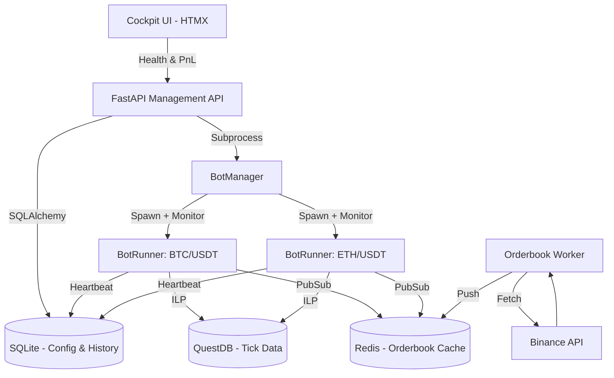

# 🏗️ Architecture Overview

The Nice Trading Platform is designed for robustness, low latency, and ease of operation. This document outlines the system's structural components and data flow.

## 🚀 High-Level Design (HLD)

The system utilizes a **decentralized, multi-process architecture** orchestrated through a central API and shared state (QuestDB, Redis, SQLite).

### 🔹 Component Diagram (Conceptual)

---

## 🛠️ Data Flow & Networking

### 1. Ingestion Layer
The `orderbook-worker` continuously polls the Binance API (via CCXT) for the top-of-book prices and pushes them into **Redis**. This ensures that all bot instances have access to the absolute latest price with sub-millisecond local latency.

### 2. Execution Layer
`BotRunner` processes operate independently. They:
1.  Fetch OHLCV historical data (QuestDB/Binance) to hydrate indicators (Pandas/NumPy).
2.  Watch Redis for real-time price updates.
3.  Execute trades using one of the **5 standard algorithms** (Scalp, Breakout, etc.).
4.  Log all analytical "thoughts" and trade actions to **QuestDB**.
5.  **Heartbeat**: Every 10s, each bot updates its status in SQLite, allowing the API to monitor for "stalled" processes.

### 3. Management & Monitoring Layer
The **Management API** provides:
-   **Health Tracking**: Visual "Pulse" for each running bot.
-   **Portfolio Analytics**: Real-time aggregation of Total PnL and Max Drawdown across the entire fleet.
-   **Circuit Breakers**: Global "Emergency Stop" that halts all active processes immediately via SQLite status broadcast.

---

## 🛡️ Security & Reliability
*   **API Resilience**: Integrated Exponential Backoff (429 handling) for all exchange interactions.
*   **Verification**: 100% logic coverage for all strategy algorithms via `pytest`.
*   **Isolation**: Each bot runs in its own memory space, preventing "cross-contamination" of strategy state.

---
*For implementation details, refer to the [Dev Onboarding guide](../getting-started/onboarding.md).*
