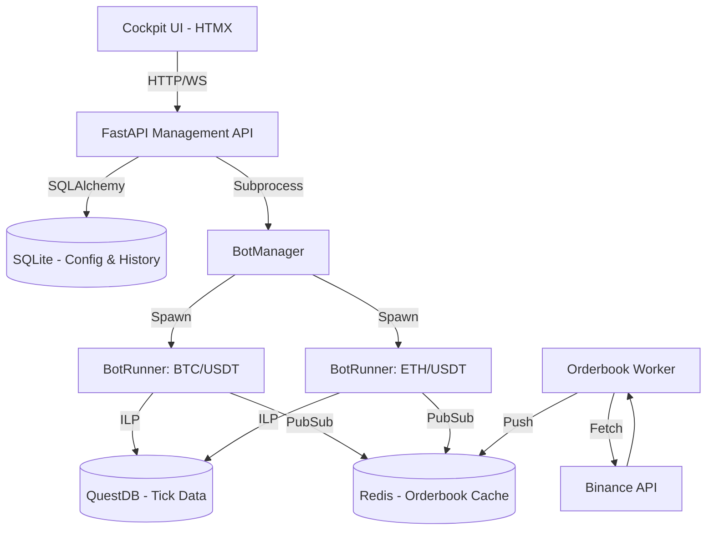

# 🏗️ Architecture Overview

The Nice Trading Platform is designed for robustness, low latency, and ease of operation. This document outlines the system's structural components and data flow.

## 🚀 High-Level Design (HLD)

The system utilizes a **decentralized, multi-process architecture** orchestrated through a central API and shared state (QuestDB, Redis, SQLite).

### 🔹 Component Diagram (Conceptual)

---

## 🛠️ Data Flow & Networking

### 1. Ingestion Layer
The `orderbook-worker` continuously polls the Binance API (via CCXT) for the top-of-book prices and pushes them into **Redis**. This ensures that all bot instances have access to the absolute latest price with sub-millisecond local latency.

### 2. Execution Layer
`BotRunner` processes operate independently. They:
1.  Fetch OHLCV historical data (QuestDB/Binance) to hydrate indicators (Pandas/NumPy).
2.  Watch Redis for real-time price updates.
3.  Execute trades based on strategy logic via `connectors/binance_connector.py`.
4.  Log all analytical "thoughts" and trade actions to **QuestDB** for post-trade analysis.

### 3. Management Layer
`BotManager` acts as the fleet admiral. It monitors the `Storage` (SQLite) for active bot configurations and ensures that a corresponding `Process` is running for every active symbol. If a bot crashes, it can be automatically restarted or alerted via Telegram.

---

## 🛡️ Security Boundaries
*   **External Gateway**: Nginx provides rate limiting and Basic Authentication.
*   **Internal Data**: QuestDB and Redis are bound to `127.0.0.1` or the internal Docker network, preventing direct external access.
*   **Isolation**: Each bot runs in its own memory space, preventing "cross-contamination" of strategy state.

---
*For implementation details, refer to the [Dev Onboarding guide](../getting-started/onboarding.md).*
