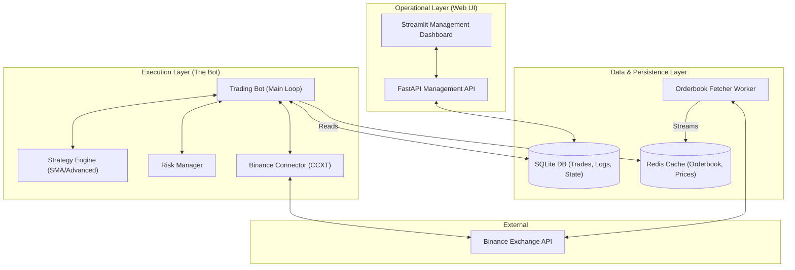

# High-Level Architecture: Private Trading Platform (Binance)

This document outlines the modular, event-driven architecture of the trading platform. It is designed for scalability, low-latency data access, and robust operational control.

## 1. System Overview

## 2. Key Components

### A. Operational Layer
*   **Management Dashboard (Streamlit)**: Provides a user interface for monitoring performance and managing the bot's lifecycle (Start/Stop/Pause).
*   **Management API (FastAPI)**: Serves as the brain for commands. It decouples the UI from the execution engine by using a "shared state" database model.

### B. Execution Layer
*   **Trading Bot**: The core process that runs the strategy loop. It is "State-Aware," meaning it checks the database at every tick to see if it should be running or if the strategy has changed.
*   **Strategy Engine**: Modular classes (e.g., `AdvancedStrategy`) that analyze market data and generate buy/sell/hold signals.
*   **Risk Manager**: A critical "Gatekeeper" that validates every trade against account balance and safety rules before it hits the exchange.

### C. Data & Persistence Layer
*   **SQLite (SQLAlchemy)**: Used for high-integrity data. Stores every trade execution, operational logs, and the current bot state.
*   **Redis Cache**: Used for high-frequency data. The bot reads the orderbook and current price from Redis to stay updated without overwhelming the exchange API.
*   **Orderbook Fetcher**: A separate background worker that constantly streams the latest L2 orderbook data into Redis.

## 3. Data Flow

1.  **Ingestion**: The `Orderbook Worker` fetches real-time data from Binance and updates `Redis`.
2.  **Analysis**: The `Trading Bot` reads the latest price from `Redis` and OHLCV from the `Connector`.
3.  **Signal**: The `Strategy Engine` processes the data and sends a signal to the `Bot`.
4.  **Verification**: The `Bot` sends the signal to the `Risk Manager`.
5.  **Execution**: If approved, the `Bot` uses the `Connector` to place an order on `Binance`.
6.  **Persistence**: The outcome of the trade is saved to the `SQLite DB`.
7.  **Monitoring**: The `Dashboard` pulls statistics from the `DB` and `API` for real-time visualization.
