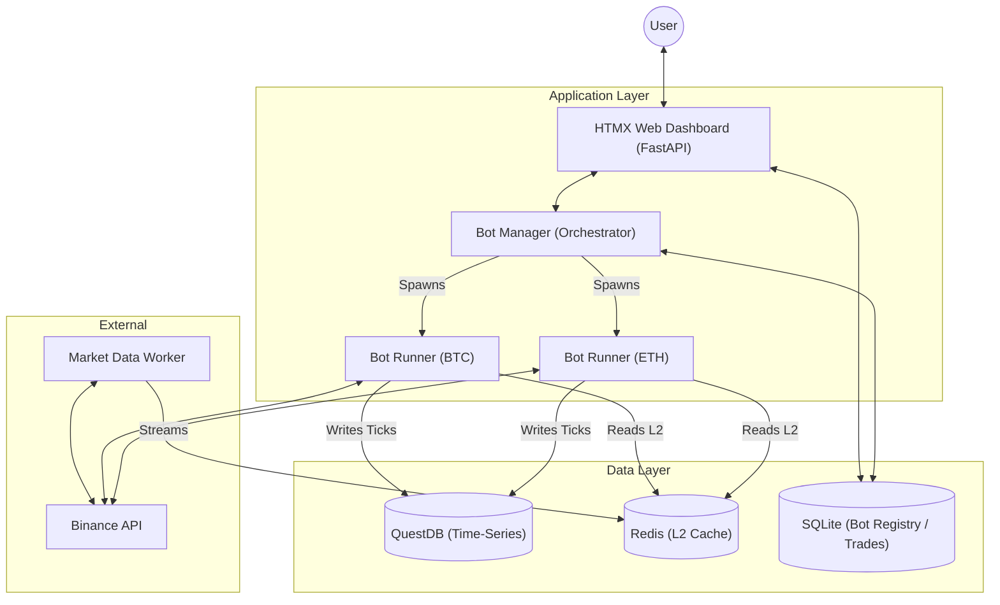
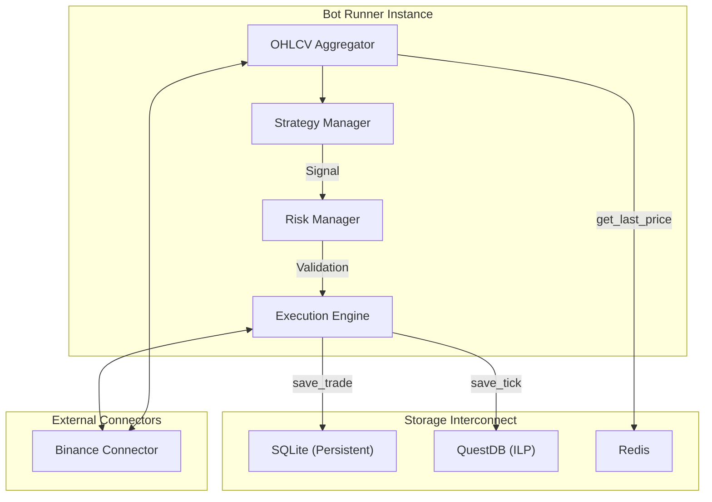

# Detailed Architecture: Nice Trading Platform

This document provides a deep dive into the system's design, from high-level orchestration to low-level component interactions.

## 1. High-Level Architecture (System Overview)

This diagram shows the major blocks and how they interact with external services and the user.

## 2. Low-Level Architecture (Process & Component)

This diagram details the internal logic of a single **Bot Runner** instance and how it uses the specialized storage modules.

## 3. Data Flow & Networking

| Flow Type | Source | Destination | Protocol | Description |
| :--- | :--- | :--- | :--- | :--- |
| **Market Data** | Binance | Local Worker | REST/WS | Real-time price and L2 orderbook ingestion. |
| **Cache** | Worker | Redis | RESP | Sub-millisecond orderbook updates. |
| **Ingestion** | Bot/Worker | QuestDB | ILP (Line Protocol) | High-throughput time-series tick logging. |
| **Control** | Web UI | SQLite | SQL | Updating bot configurations and favorites. |
| **Orchestration**| Manager | Sub-processes | Signals | Starting/Stopping bot instances via Multiprocessing. |

## 4. Deployment Architecture (Docker)

All services are isolated in Docker containers within a shared bridge network.

*   **Service: `api`**: Runs the FastAPI server (Port 8000).
*   **Service: `manager`**: Runs the Bot Manager service.
*   **Service: `worker`**: Runs the high-frequency market data fetcher.
*   **Service: `redis`**: High-speed memory store.
*   **Service: `questdb`**: Low-latency time-series database.
*   **Volume: `trading_data`**: Persists the SQLite database and logs across container restarts.
